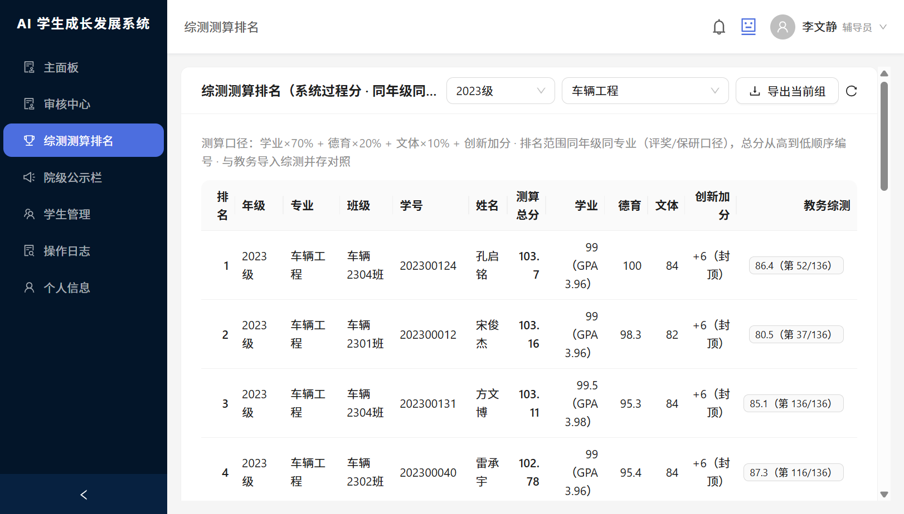
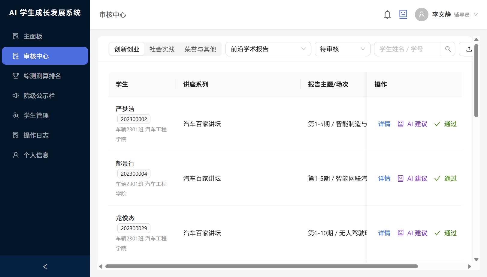
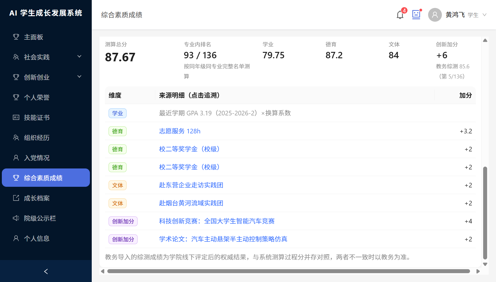
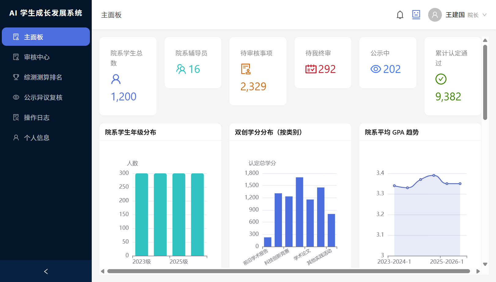
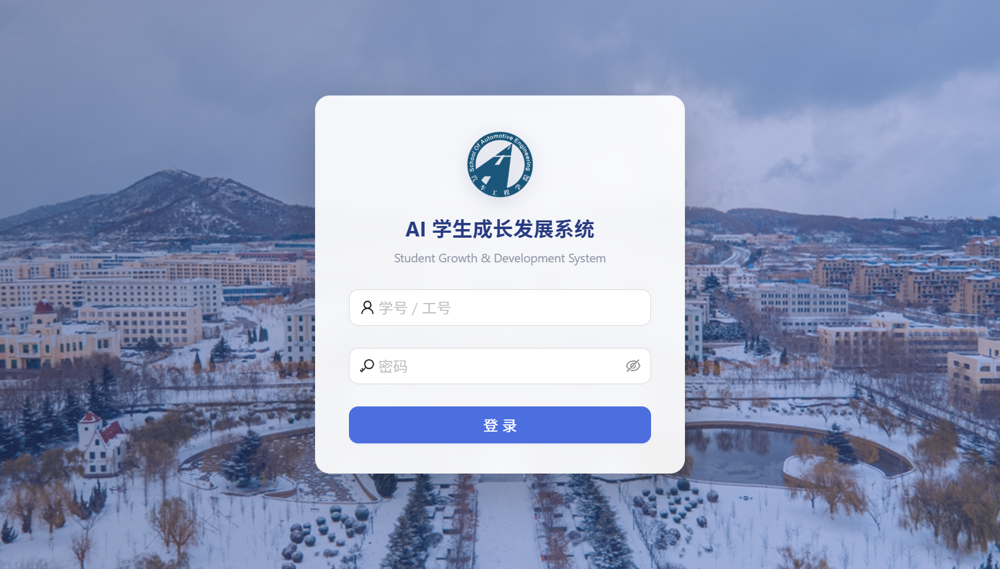
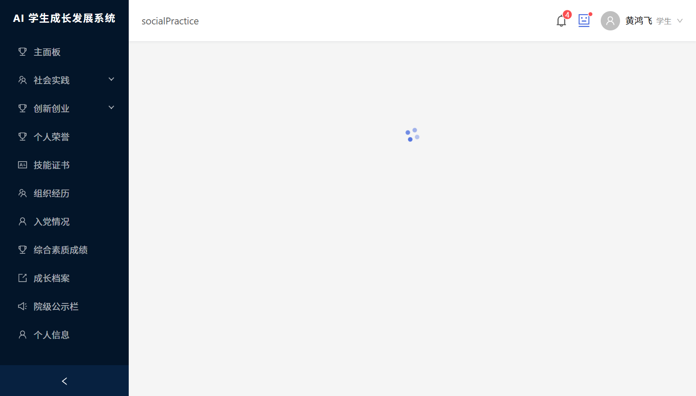
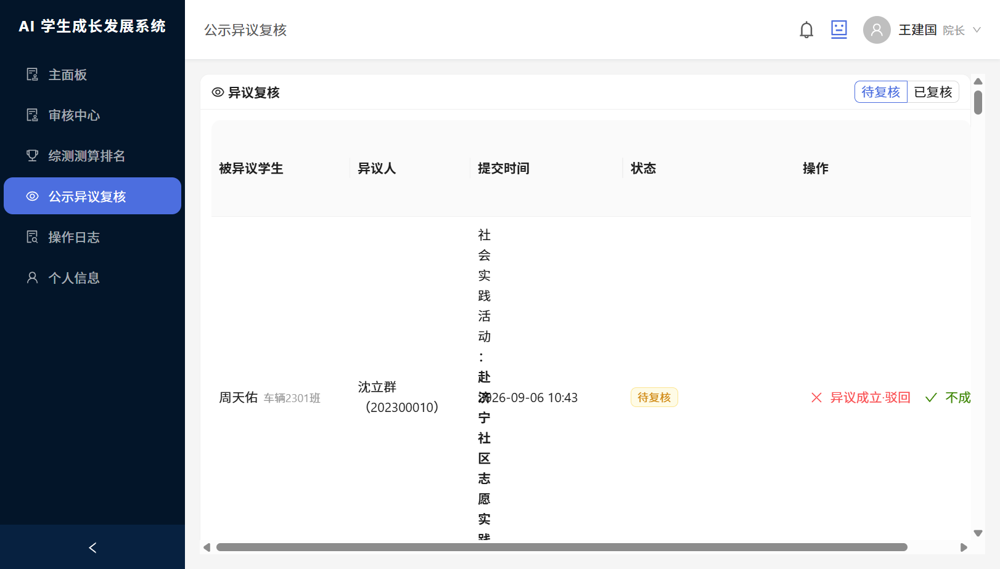
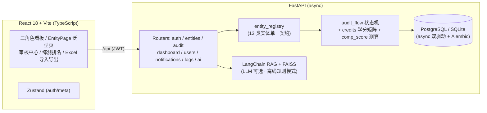

# AI 学生成长发展系统（growth-system）

前后端分离的「第二课堂成绩单」管理系统，面向 **学生 / 辅导员 / 院长** 三种角色，覆盖 **申报 → 分级审核 → 公示异议 → 生效归档 → 综测测算 → 报表导出** 的完整业务闭环，内置 LangChain + RAG 的 AI 助手（表单填充 / 审核建议 / 规则问答）。

> 演示规模：4 个年级 × 4 个专业 × 1200 名学生、16 名辅导员按「年级 × 专业」带班、9 类学分类别全量模拟数据。

| 综测测算排名（系统过程分 + 教务权威对照） | 审核中心（批量审批 + AI 建议） |
|---|---|
|  |  |
| **学生综测测算卡（加分项逐条可追溯）** | **院长看板（统计 + 公示异议复核）** |
|  |  |

<details>
<summary>更多截图：登录 / 学生申报 / 公示异议复核</summary>

| 登录 | 学生申报页（申报窗口控制） | 公示异议复核 |
|---|---|---|
|  |  |  |

</details>

## 核心设计决策（为什么这么做）

### 1. 实体注册表驱动 —— 13 类记录，零路由 / 零页面代码

社会实践、志愿服务、8 类创新创业、荣誉、证书、组织经历、入党情况由 `entity_registry` 一处定义，前后端共用一份契约：

- 后端：通用 CRUD `/api/entities/{key}` + 统一审核流 `/api/audit/*`，新增实体类型不改路由
- 前端：`EntityPage` 泛型组件按契约渲染表格 / 搜索 / 表单 / 详情
- 学分核定、审核 AI 建议、看板统计、综测测算同样由注册表循环驱动

### 2. 分级审核流状态机 —— 关键实体院长终审，日常事务辅导员直达

```
待审核 ──(辅导员通过 · 日常类)──────────────▶ 公示中 ──(期满)──▶ 通过
   │                                            ▲
   ├──(辅导员通过 · dean_review 类)──▶ 待院长审批 ──(院长通过)──┘
   │                                            │
   └── 驳回（任意非生效态可驳回，附意见并通知，学生可改后重报）
```

- **为什么惰性晋升**：公示期满由数据库会话内读时晋升，不做后台调度器——低频事务系统中调度器是纯运维负担
- **dean_review 实体级路由**：科技竞赛 / 学术论文 / 专利 / 创业项目 / 个人荣誉等高价值认定由院长终审，讲座 / 社会实践等日常项辅导员直达，避免院长成为吞吐瓶颈
- **申报窗口**：窗口外学生不可自主申报；辅导员 / 院长 Excel 补录豁免（历史数据迁移通道）
- **已生效纠错**：只有院长可以驳回已生效记录（公示异议成立），全程留痕

### 3. 学分核定防注入 —— 客户端传不了任何分值

学分按「类别 × 级别 × 等级 × 完成次序」规则矩阵在服务端核定，申报提交时与进入公示时**双次重算**——学生改不了自己的学分，规则调整后旧记录在生效前自动按新规校准。

### 4. 综测测算引擎 —— 系统过程分与教务权威结果并存

- 口径：`总分 = 学业×70% + 德育×20% + 文体×10% + 创新学分加分（封顶 6）`，全部参数收敛在服务端规则配置
- **只统计已生效记录**，与审核流状态机咬合；读时计算不落库，无后台任务
- 德育 / 文体加分逐条**可追溯**（点击直达对应记录：志愿 128h +3.2、国家级荣誉 +5……）
- 排名口径**同年级同专业**（评奖 / 保研的真实口径），总分从高到低顺序编号
- 教务导入的综测成绩排名**并列对照**展示，不一致时以教务为准——系统测算定位是「过程透明化」，不越权替代线下评定

### 5. Excel 批量导入 —— 前端解析 + 服务端逐行校验防呆

- 纯前端 SheetJS 解析（表头即字段名），服务端逐行校验：单行报错不阻断整批
- 年级 / 学院 / 专业必须命中业务字典（「2023」自动补「级」），select / cascader 控件端到端防呆

### 6. 合规留痕 —— append-only 操作日志

登录 / 增删改审全埋点，字段级 diff，日志只增不改不删（审计要求）；按角色数据权限检索。

### 7. 通知与降级策略

- 状态流转全链路触达（驳回 / 转院 / 终审通过 / 公示生效），按角色深链直达对应记录页
- SMTP 可选，未配置优雅降级为站内信；低频场景用轮询而非 SSE——不为简历关键词引入运维成本

### 8. AI 能力 —— 配置即增强，缺省不阻塞

- `POST /api/ai/chat`：SSE 流式对话，RAG 检索 `knowledge_base/*.md`（学分规则 / 综测细则），回答口径与系统规则一致
- 表单助手：一句话描述 → 自动填充实体表单；审核助手：建议通过 / 驳回 + 理由
- LLM 未配置 Key 自动进入离线规则模式；Embedding 未配置降级本地 TF-IDF 向量（FAISS → BGE-M3 可选）

## 架构



## 快速启动

```bash
# 后端（Python 3.11+）
cd server
python -m venv .venv
.venv\Scripts\pip install -r requirements.txt
copy .env.example .env          # LLM_API_KEY 可留空，离线规则模式运行
.venv\Scripts\python seed.py    # 1200 学生 + 16 辅导员 + 全量演示数据
.venv\Scripts\python -m uvicorn main:app --host 0.0.0.0 --port 8000

# 前端（Node 18+）
cd web
npm install
npm run dev                     # http://localhost:3000（/api 代理到 8000）
```

### 演示账号（密码均为 `123456`）

| 角色 | 账号 | 说明 |
|---|---|---|
| 学生 | `202300001` ~ `202300300` | 202300001 数据最全，建议用这个 |
| 辅导员 | `C0001` ~ `C0016` | 按「年级 × 专业」带班，C0001 = 2023 级车辆工程 |
| 院长 | `D0001` | 全院视角 + 公示异议复核 + 报表导出 |

## 测试

```bash
cd server
.venv\Scripts\python -m pytest tests/ -v
# 14 个接口用例：审核流全链路、权限越权分支、申报窗口、Excel 导入、综测测算
```

## 目录结构

```
growth-system/
├── web/                        # React 18 + TS + Antd 5
│   └── src/
│       ├── api/                # axios 封装 + API 模块
│       ├── components/         # 布局 / 泛型实体字段 / Excel 导入 / AI 抽屉 / 通知
│       ├── pages/              # dashboard(三角色) / entity(13 类通吃) / audit / comp-rank / students / logs
│       └── types/              # 与后端契约一一对应的 TS 类型
└── server/                     # FastAPI
    ├── app/
    │   ├── routers/            # auth / entities / audit / objections / dashboard / users / notifications / logs / ai
    │   ├── services/           # entity_registry / audit_flow / credits / comp_score / oplog / notify / agent / rag
    │   └── models/             # SQLAlchemy 2 async 模型
    ├── knowledge_base/         # RAG 知识库（学分规则 / 综测细则 markdown）
    ├── seed.py                 # 演示数据（1200 学生 / 16 辅导员 / CSV 快照导出）
    └── tests/                  # pytest 接口测试
```

## Roadmap（主动亮差距）

- [x] SQLite → PostgreSQL 双驱动（连接工厂一处切换；容器/CI 跑真 PG 全量测试）
- [x] Docker Compose 一键起（postgres + server + web/nginx）+ GitHub Actions CI（ruff + pytest + eslint + build）
- [x] Alembic 迁移链：schema 单一事实源（baseline + 惰性晋升，弃用 create_all 双路径）
- [ ] 前端组件测试（Vitest + React Testing Library）
- [ ] 看板统计缓存与查询量化（压测数字待补）
- [ ] 对接统一身份认证（当前演示账号体系）

## 端口规范

- 后端 **8000**：`/api` 业务接口、`/files` 静态文件
- 前端 **3000**：Vite dev server，`/api`、`/files` 代理到 8000
